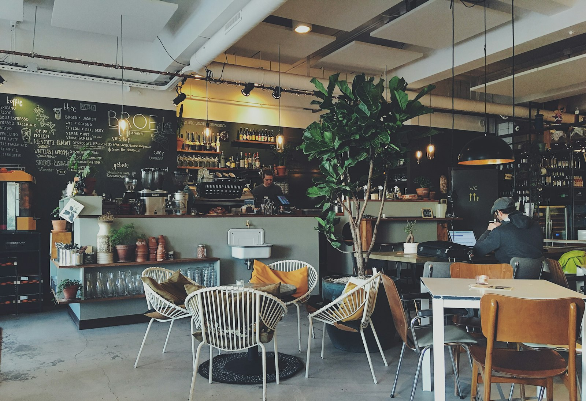

# AMARA | Botanical Roastery & Café — Bengaluru ☕🌿

> Artisanal specialty coffee, slow bakery, and serene sunlit spaces on 12th Main, Indiranagar, Bengaluru.



---

## ✨ Features & Architecture

- **Clean Editorial Design**: Minimalist warm beige, linen, soft cream, and deep roasted coffee tones.
- **Editorial Story Format**: Balanced typography and authentic photography highlighting the sanctuary philosophy.
- **Classic Café Dot-Leader Menu**: Clean categorized tabs (*Coffee & Brews*, *Bakery & Brunch*, *Cold Sips & Teas*) with prices in Indian Rupees (₹) and concise 1-line flavor notes.
- **Authentic Stock Photography**: Real café visuals showcasing the coffee bar, latte art, and flaky viennoiserie.
- **Easy 1-Minute Table Reservations**: Streamlined booking with instant on-screen confirmation pass.
- **Responsive & Performance First**: Fast vanilla HTML5/CSS3/ES6+ implementation with zero heavy external libraries.

---

## 🚀 Running Locally

Open `index.html` in any web browser or run:

```bash
git clone https://github.com/404existential/aura-cafe.git
cd aura-cafe
```

---

## 📄 License

MIT License. Designed with reverence for Bengaluru's specialty coffee culture.
