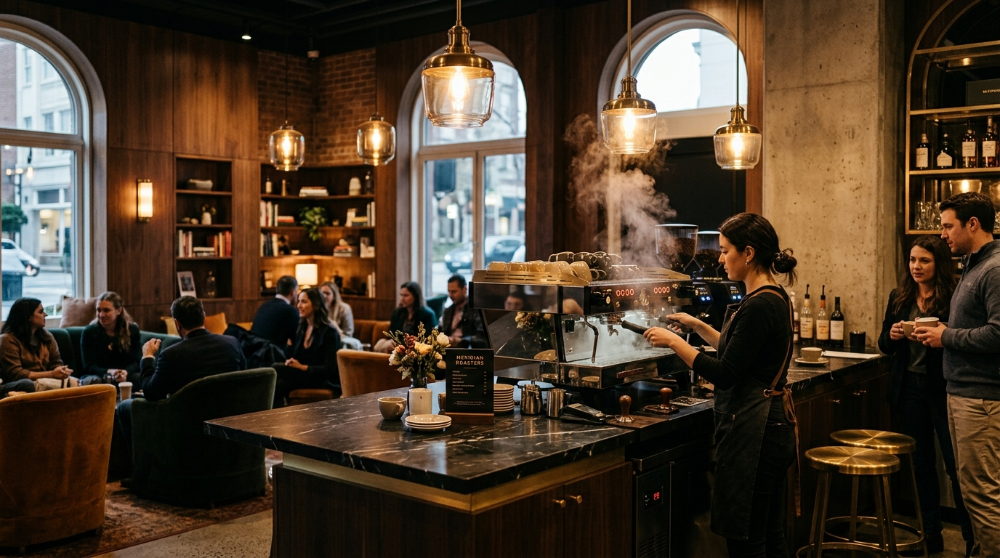

# AMARA | Botanical Roastery & Café — Bengaluru ☕🌿

> Single-estate Western Ghats coffees, hand-laminated morning bakes, and slow living in Indiranagar, Bengaluru.



---

## ✨ Highlights & Design System

- **Warm Beige & Linen Aesthetic**: Calm, sunlit tropical minimalist aesthetic with warm sand, cream, terracotta, and deep espresso tones.
- **Rooted in Bengaluru**: Highlights single-origin shade-grown Arabica from Chikmagalur and Coorg hill estates, roasted fresh on 12th Main, Indiranagar.
- **Clean Concise Menu**: Compact 2-column editorial layout with pricing in Indian Rupees (₹) and concise 1-line flavor notes. No cluttered blocks.
- **Easy 1-Minute Table Booking**: Simplified reservation form with instant on-screen booking pass and SMS/WhatsApp confirmation details.
- **Harmonious Visual Spaces**: Balanced photo cards with clean labels showcasing the botanical courtyards, brew bar, and morning bakery.
- **Community Praise & Press**: Feature mentions from *LBB Bengaluru*, *Condé Nast Traveller*, and *Bangalore Times*.
- **Direct Location & Map**: Embedded Google Maps widget, transit metro notes, and opening hours.

---

## 🛠️ Tech Stack

- **Markup**: Clean semantic HTML5
- **Styling**: Vanilla CSS3 (Custom warm beige & linen design tokens)
- **Logic**: Vanilla ES6+ JavaScript
- **Icons**: Font Awesome 6.5.1
- **Typography**: Google Fonts (*Cormorant Garamond* & *Plus Jakarta Sans*)

---

## 🚀 Running Locally

Open `index.html` directly in any web browser or serve with a local server:

```bash
git clone https://github.com/404existential/aura-cafe.git
cd aura-cafe
```

---

## 📄 License

MIT License. Crafted with reverence for Bengaluru's specialty coffee culture.
